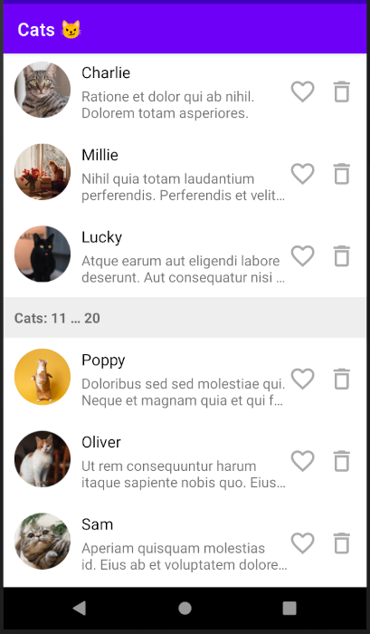

# Elementary RecyclerView Adapter

[](https://elveum.com/sh/adapter)

[](LICENSE)

> Another one easy-to-use adapter for `RecyclerView` :rocket:

__Features:__

- DSL-like methods for building adapters similar to Jetpack Compose but intended for `RecyclerView`
- no view holders; bind any model object directly to auto-generated [view bindings](https://developer.android.com/topic/libraries/view-binding)
- support of multiple item types
- build-in click listeners
- the library uses `DiffUtil` under the hood for fast updating of your list



## Usage example

This library adds a few methods for easier implementation of `ListAdapter`. It relies on [View Binding](https://developer.android.com/topic/libraries/view-binding) so you don't need to create view holders.

__Simple example (1 item type)__

Let's image you have `Cat` model class and `R.layout.item_cat` ([View Binding](https://developer.android.com/topic/libraries/view-binding) generates `ItemCatBinding` class for this layout). Then you can write the following code:

```kotlin
val adapter = simpleAdapter<Cat, ItemCatBinding> {
     areItemsSame = { oldCat, newCat -> oldCat.id == newCat.id }
     bind { cat ->
         catNameTextView.text = cat.name
         catDescriptionTextView.text = cat.description
     }
     listeners {
         root.onClick { cat ->
             showCatDetails(cat)
         }
     }
 }

 recyclerView.adapter = adapter

 viewModel.catsLiveData.observe(viewLifecycleOwner) { list ->
     adapter.submitList(list)
 }
```

As you see, `simpleAdapter<Item, ViewBinding>` accepts 2 types:
- any type of your model (`Cat`)
- an implementation of `ViewBinding` which you don't need to write because the official [View Binding](https://developer.android.com/topic/libraries/view-binding) library can do it.

Then use `bind` and `listen` methods to bind your item to views and assign listeners respectively. You can access all views from you binding class inside the `bind` and the `listeners` sections by `this` reference (which can be also omitted):

```kotlin
val adapter = simpleAdapter<Cat, ItemCatBinding> {
    bind { cat -> // <--- your item to bind
        // access views by 'this' reference
        this.myTextView.text = cat.name
        // or directly by name in the generated binding class:
        myTextView.text = cat.name
    }
}
```

It's highly recommended to use a separate `listeners` section to assign click and long-click listeners to your views to avoid unnecessary object creation during item binding:

```kotlin
val adapter = simpleAdapter<Cat, ItemCatBinding> {
    ...
    listeners {
        // onClick for clicks
        deleteButton.onClick { cat ->
            viewModel.delete(cat)
        }
        // onLongClick for long clicks
        root.onLongClick { cat ->
            Toast.makeText(requireContext(), "Oooops", Toast.LENGTH_SHORT).show()
            true
        }
    }
}

```

Optionally you can adjust the logic of comparing old and new items by using `areItemsSame` and `areContentsSame` properties. They work in the same way as methods of `DiffUtil.ItemCallback` ([click here](https://developer.android.com/reference/androidx/recyclerview/widget/DiffUtil.ItemCallback) for details). By default `areItemsSame` and `areContentsSame` compare items in terms of `equals`/`hashCode` so usually you don't need to use `areContentsSame` for data classes. But it's recommended to implement at least `areItemsSame` to compare your items by identifiers.

Typical example:

```kotlin
val adapter = simpleAdapter<Cat, ItemCatBinding> {
    // compare by ID
    areItemsSame = { oldCat, newCat -> oldCat.id == newCat.id }
    // compare content
    areContentsSame = { oldCat, newCat -> oldCat == newCat }
}
```

__Another example (2 item types)__

Let's add headers after every 10th cat to the list. For example, we can define the following structure:

```kotlin
sealed class ListItem {

    data class Header(
        val id: Int,
        val fromIndex: Int,
        val toIndex: Int
    ) : ListItem()

    data class Cat(
        val id: Long
        val name: String
        val description: String
    ) : ListItem()

}
```

Add layout for each item type: `R.layout.item_cat` (`ItemCatBinding` will be generated) and `R.layout.item_header` (`ItemHeaderBinding` will be generated).

Then we can write an adapter by using `adapter` and `addBinding` methods:

```kotlin
val adapter = adapter<ListItem> { // <--- Base type

    // map concrete subtype ListItem.Cat to the ItemCatBinding:
    addBinding<ListItem.Cat, ItemCatBinding> {
        areItemsSame = { oldCat, newCat -> oldCat.id == newCat.id }
        bind { cat ->
            catNameTextView.text = cat.name
            catDescriptionTextView.text = cat.description
        }
        listeners {
            deleteImageView.onClick(viewModel::deleteCat)
            root.onClick { cat ->
                viewModel.openDetails(cat)
            }
        }
    }

    // map concrete subtype ListItem.Header to the ItemHeaderBinding:
    addBinding<ListItem.Header, ItemHeaderBinding> {
        areItemsSame = { oldHeader, newHeader -> oldHeader.id == newHeader.id }
        bind { header ->
            titleTextView.text = "Cats ${header.fromIndex}...${header.toIndex}"
        }
    }
}
```

Then assign the list with cats and headers to the adapter by using `submitList` method:

```kotlin
val list: List<ListItem> = getListFromSomewhere()
adapter.submitList(list)
```

## Installation

- Add [View Binding](https://developer.android.com/topic/libraries/view-binding) to
  your `build.gradle` file:

  ```
  android {
      ...
      buildFeatures {
          viewBinding true
      }
      ...
  }
  ```

- Add the library to the `dependencies` section of your `build.gradle` script:

  ```
  dependencies {
      ...
      implementation 'com.elveum:element-adapter:0.2'
  }
  ```

## Changelog

### v0.1

- The first release

### v0.2

- Added `context()` extension method
- Updated minSDK from 23 to 21

## License

[Apache License 2.0](LICENSE)